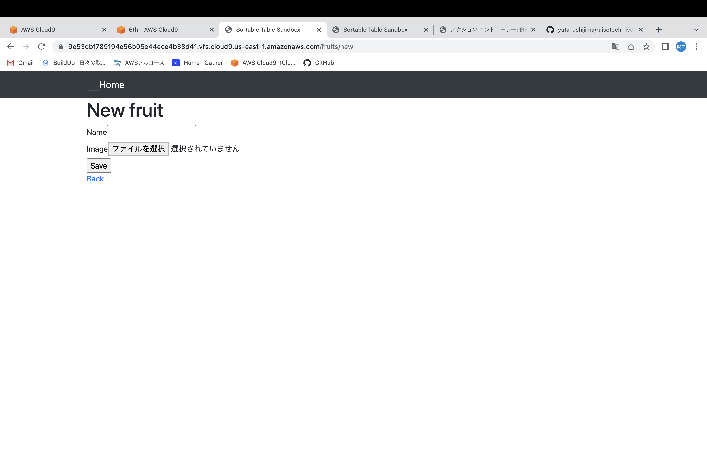
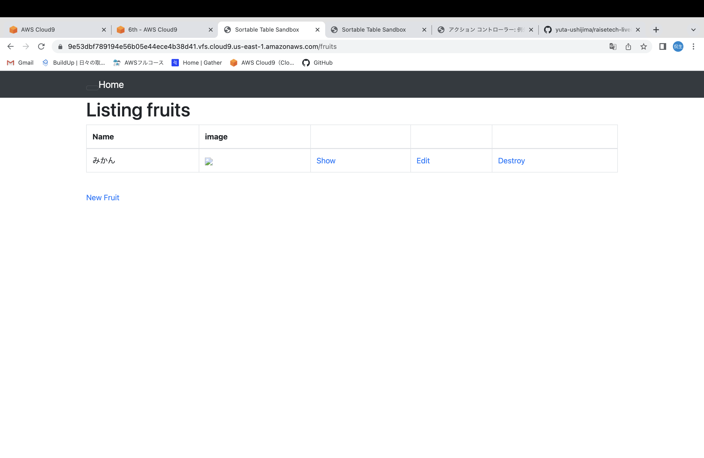
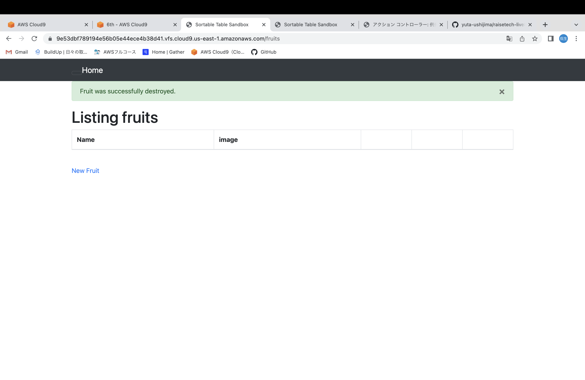
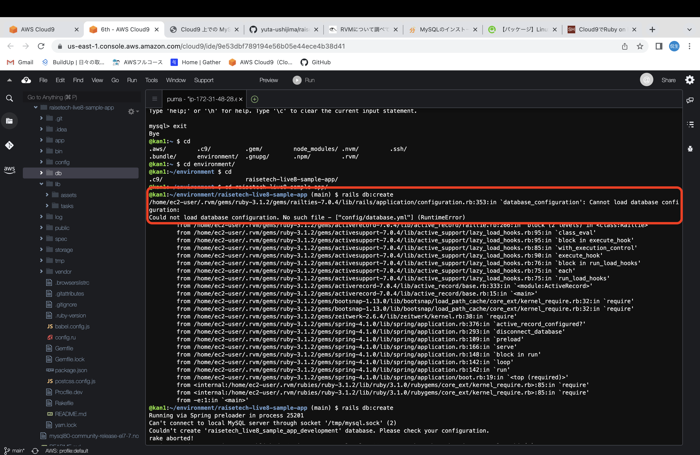
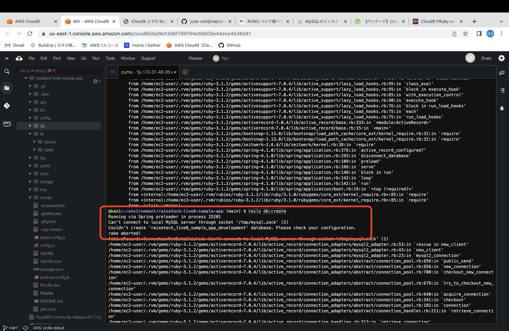
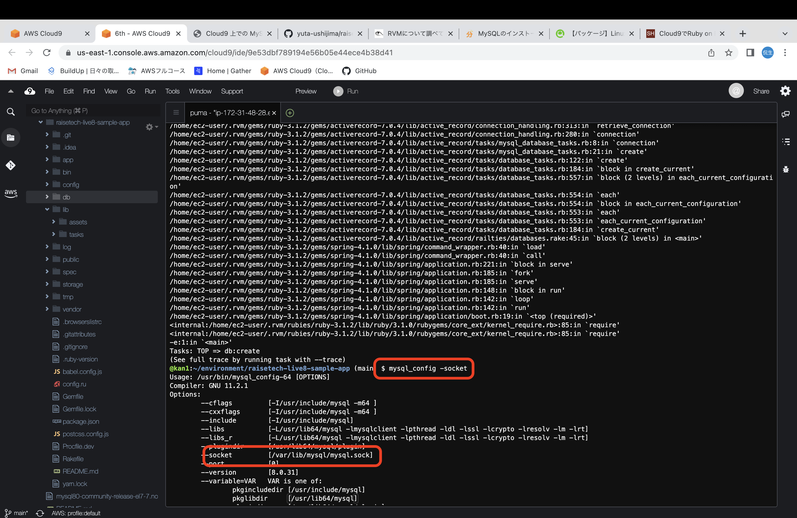
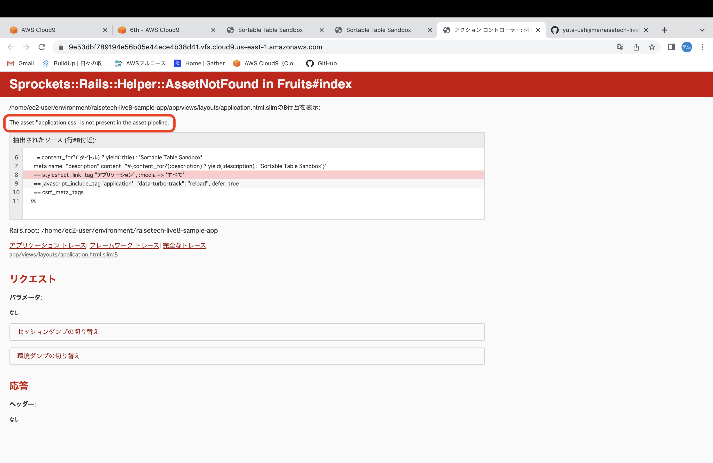
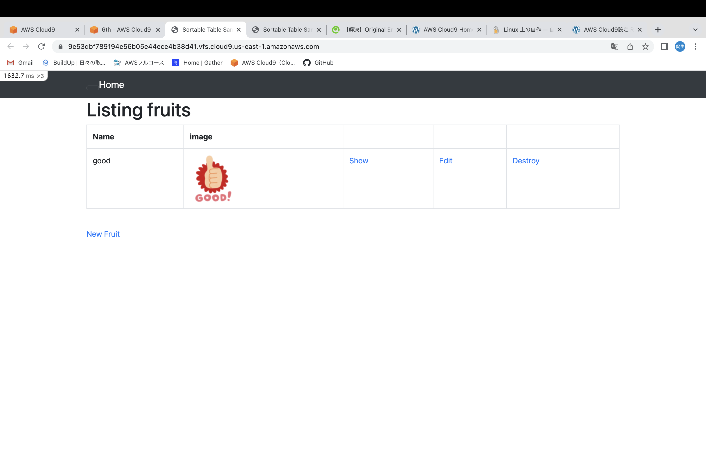

# 第３回講習と課題

## 課題について

1. RVMのインストール<bar>

    - 基本的には[公式サイト](https://rvm.io/rvm/install)参照

        |コマンド          | 内容       |
        |:--------|:-----|
        |`rvm list known`|インストール可能なRuby一覧|
        |`rvm install 3.1.2`|Ruby3.1.2をインストール|
        |`rvm use 3.1.2 --default`|デフォルトで使用するRuby指定|
        |`ruby -v`|バージョン確認|

2. MySQLのインストールと起動確認

    - インストール

        `wget https://dev.mysql.com/get/mysql80-community-release-el7-7.noarch.rpm`

        `sudo yum localinstall -y mysql80-community-release-el7-7.noarch.rpm`
    

        ※インストール前にその他のDBがないか確認する
    
    -  インストールファイル

        `sudo yum install -y mysql-community-devel`

        `sudo yum install -y mysql-community-server`

        ※[yumとは](https://qiita.com/sksmnagisa/items/05a6f8a707010b8bea56)

    
    - 起動確認

        `sudo service mysqld start && sudo service mysqld status`

    - 初期パスワード確認
    
        `sudo cat /var/log/mysqld.log | grep "temporary password" | awk '{print $13}'`

    - MySQL起動

        `mysql -u root -p`
    
    - password 変更

        `SET PASSWORD FOR root@localhost = 'パスワード';`
        
        ※8文字以上(大文字・小文字・数字・特殊記号)
    
3. Railsのインストール

    - バージョン指定でのインストール

        `gem install rails -v 7.0.4`

4. Yarnのインストール

    - インストール

        `npm install --global yarn`

    - バージョン確認

        `yarn -v`

5. bundlerによるgemのインストール

    - バージョン確認

        `bundle -v`

    - gemのインストール

        `bundle install`

        ※gemfileのカレントディレクトリ内で実行する

6. DBの作成

    - データベースを作成して、アプリのmigrationファイルを適応

        `rails db:create`

        `rails db:migrate`

        ※[migrate:マイグレーションファイルとは](https://qiita.com/jackie0922youhei/items/09a7b081e40506f07358)

7. マスターファイルを作成する

    - 本番環境用にプリコンパイルする

        `RAILS_ENV=production bin/rails assets:precompile`

        ※[アセットパイプラインとは](https://blog.mothule.com/ruby/rails/ruby-rails-assets-pipeline-use#%E3%82%A2%E3%82%BB%E3%83%83%E3%83%88%E3%81%AE%E3%82%B3%E3%83%B3%E3%83%91%E3%82%A4%E3%83%AB%E3%81%AF%E7%92%B0%E5%A2%83%E4%BE%9D%E5%AD%98)

8. 起動する

    - railsを起動する

        `rails s`

            
                     ↓起動後のスクリーンショット↓

        

-----

### 『エラー備忘録』

- エラー１

↑databese.ymlに名前変更

- エラー２

↑socketの場所確認後、変更　↓参考画像

- エラー３

↑プリコンパイル実施

------
### **AP サーバーについて調べてみましょう。**

    1. AP サーバーの名前とバージョンを確認してみましょう。

        → Puma version: 5.6.5

    2.AP サーバーを終了させた場合、引き続きアクセスできますか?
    
        → アクセスできない。起動後はアクセスできる。

### **DB サーバーについて調べてみましょう。**

    1. DB サーバー(DB エンジン)の名前と、今 Cloud9で動作しているバージョンはいくつか確認してみましょう。

        → Server version: 8.0.31 MySQL

    2. DB サーバーを終了させた場合、引き続きアクセスできますか?

        → できない。

### **Rails の構成管理ツールの名前は何でしたか?確認してみてください。**

        → Bundler

### **今回の課題から学んだことを報告してください。**

- エラーがたくさん出てかなり苦労した。今まではエラーの意味を考えず、すぐ検索していた。今回はエラーの意味を自分なりに考えながら、できた。
- 結構達成感を味わた！

---

## 追記

 - 動作確認時、サムネ画像が反映されない不具合あり
 　

        →サムネ表示されない時の挙動をターミナルで確認、Imagemagickが必要とわかった。
        

[imagemagikのインストール](http://entame-life.xyz/2021/01/15/post-469/)

        
        ↑インストールは上記参照
        
        
