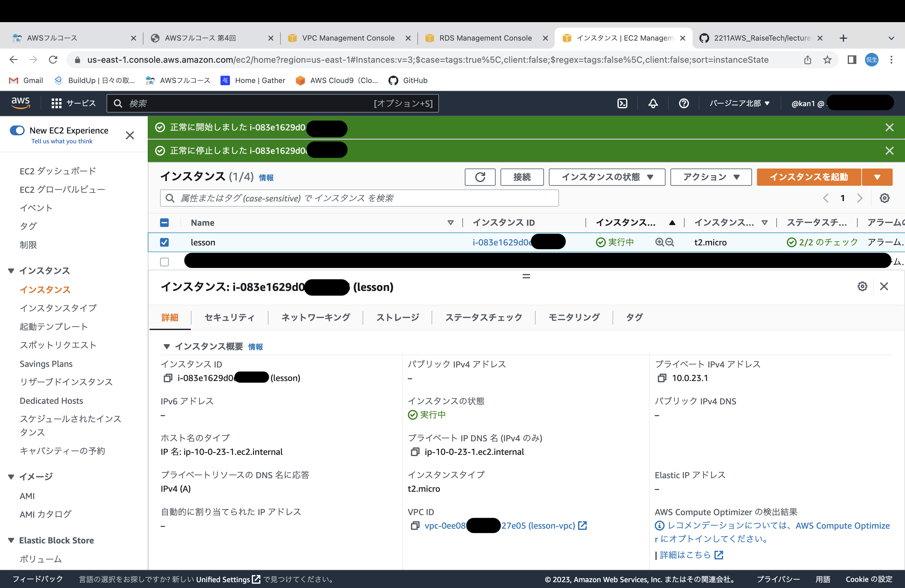
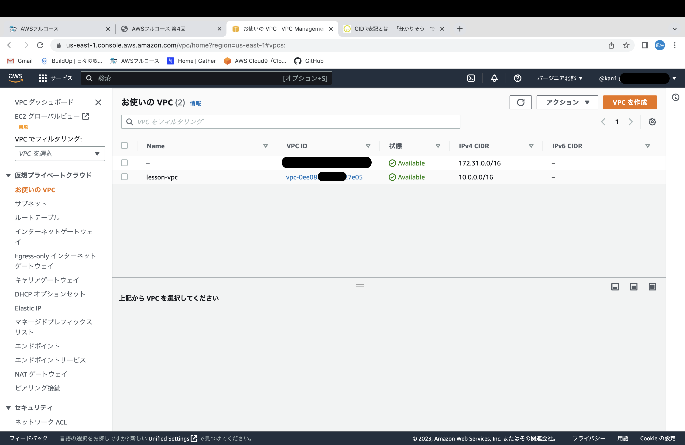
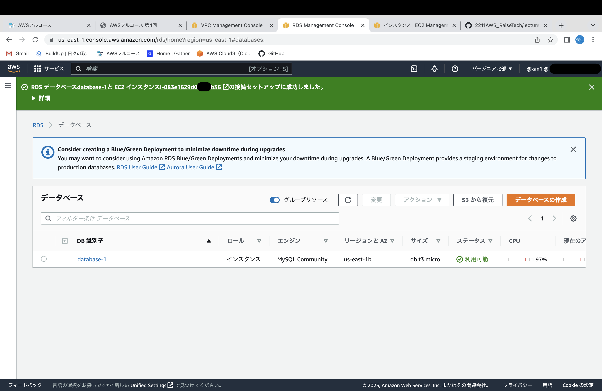
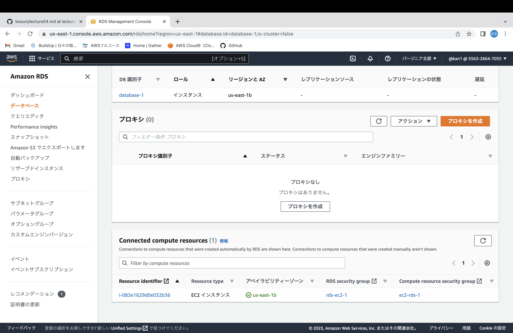
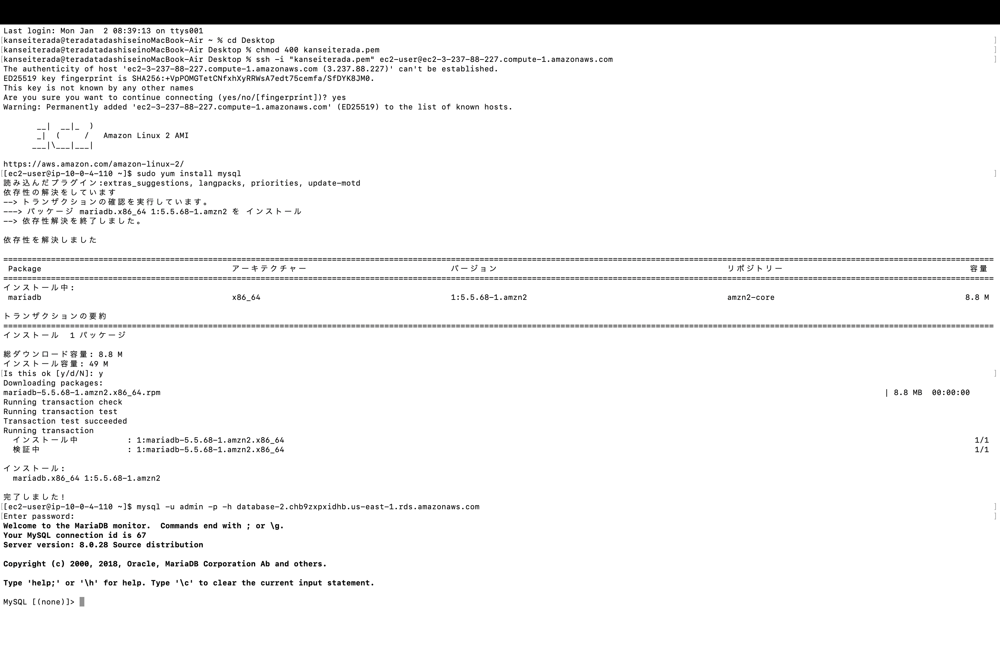

# 第４回講習と課題

## EC2について

 - EC2とは、仮想サーバーを作成できるサービスのこと。

 - 仮想サーバーを**インスタンス**という単位で管理している。

 - インスタンスタイプの名前のルールは以下の通り。

    **m6g.medium**　　→ 『ファミリー』『世代』『追加機能』.『サイズ』

    ファミリー・・メモリ重視やCPU重視など特徴ごとに文字列がある。

    |ファミリー|特徴|
    |---|---|
    |T|バースト可能汎用タイプ|
    |M|バランス型汎用タイプ|
    |C|コンピューティング最適化vCPU数が多い| 
    |R|メモリ最適化メモリ搭載量が多い|

    世代・・数が大きいほど新しく高性能

    追加機能・・Graviton2(CPU)のｇやネットワーク強化のnなどがある

    サイズ・・サイズが大きいほど、高性能・高価

 - EC2を配置するネットワークを**サブネット**という。

 - EC2のアクセス制御には、**セキュリティグループ**を使用する。

 - EC2への通信を**インバウンドルール**,EC2から外部への通信を**アウトバウンドルール**という形式で指定。

 - ネットワークとポート番号を指定することで、通信を許可できる。ポート番号は、通信の種類で決まる。↓
 
        ex) SSH・・２２番ポート　HTTP・・８０番ポート
    
 - 許可は可能だが、拒否はできない。

-------

## VPC

 - VPCとは、AWS上に作成できる、プライベート仮想ネットワーク空間のこと。

 - CIDRブロックを指定し、指定したCIDRブロックのネットワークを確保する。

    ※[CIDRとは](https://wa3.i-3-i.info/word11990.html)

 - VPCの中に、さらに細かいネットワーク単位であるサブネットを作成する必要がある。

 - サブネットは、１つのAZに所属する必要がある。    

 ------

## RDS 

- リレーショナルデータベースを提供するサービス。

- リレーショナルデータベースとは、表形式のデータベースのこと。（RDB）

    * １つの表を**テーブル**という単位で管理する。

    * データベースに行う処理のひとまとまりを**トランザクション**という。

    * RDSで稼働するサバーもEC2と同様に、インスタンスと呼ぶ。

    * EC2と同様にインスタンスタイプの名前のルールがある。

----
## 課題画像

