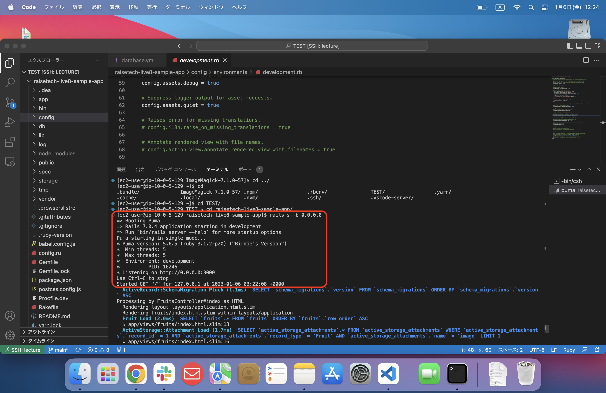
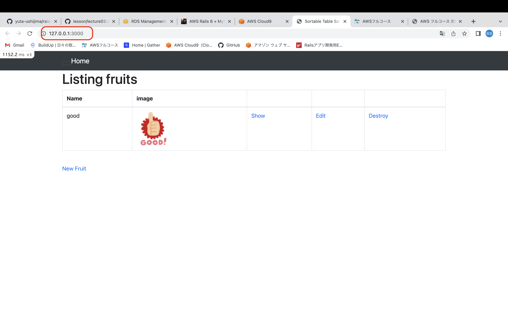
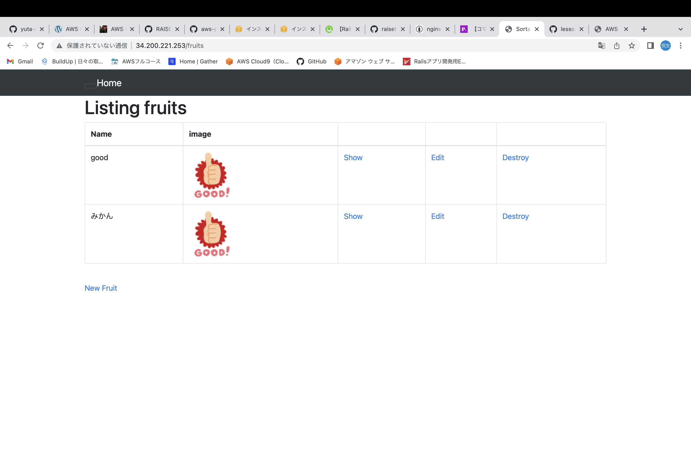
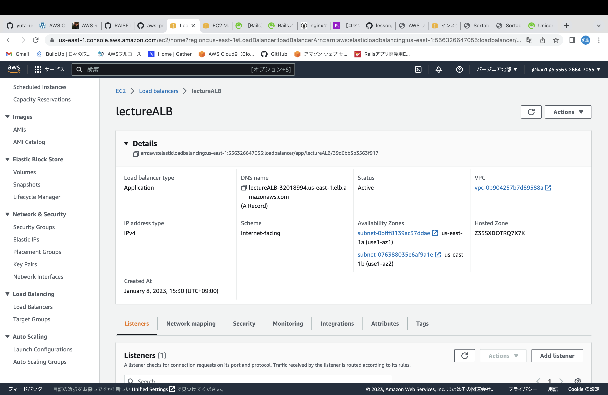
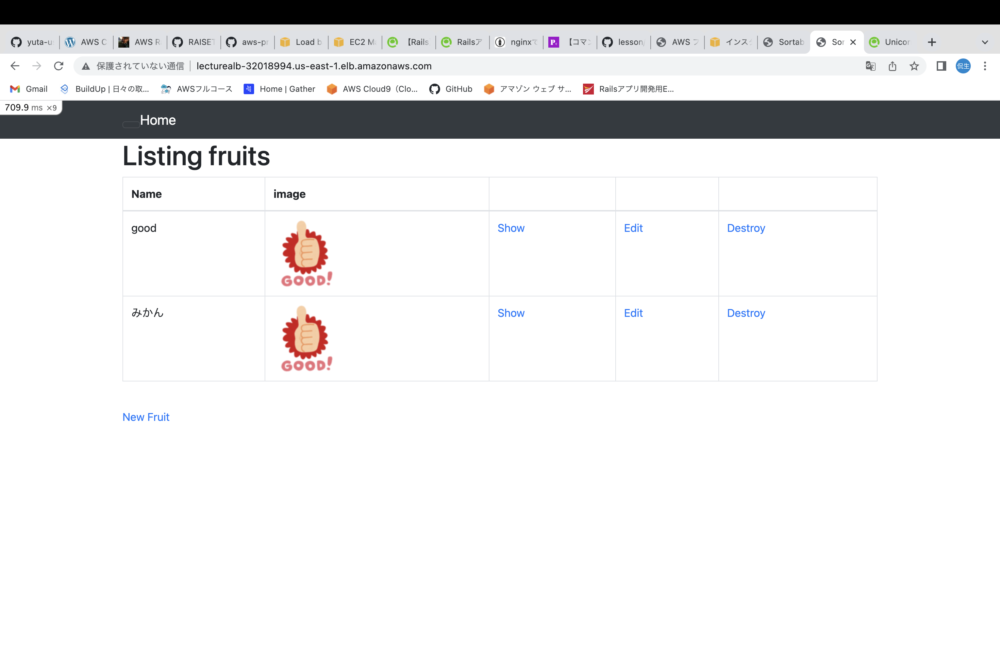
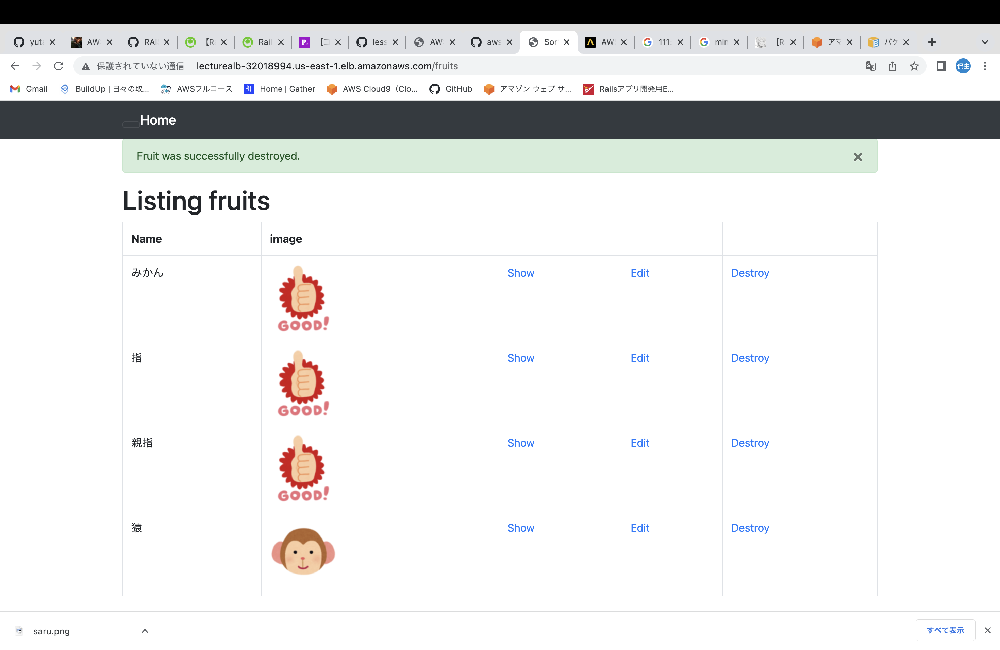
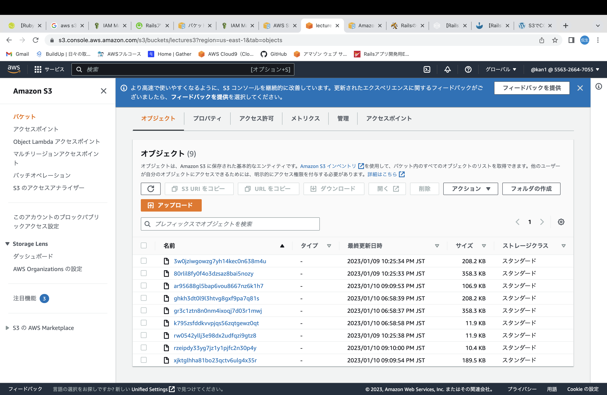

# 第５回課題

## 組み込みサーバーでの起動

1. パッケージをアップデート
　
```
$ sudo yum update -y
```
2. rails立ち上げに必要なパッケージをインストール

```
$ sudo yum install -y gcc-c++ glibc-headers openssl-devel readline libyaml-devel readline-devel zlib zlib-devel libffi-devel libxml2 libxslt libxml2-devel libxslt-devel sqlite-devel
```
3. rbenvのインストール
```
$ sudo yum install -y git
$ git clone https://github.com/sstephenson/rbenv.git ~/.rbenv
```
* コマンド実行できないのでPATHを通す
```bash
$ echo 'export PATH="$HOME/.rbenv/bin:$PATH"' >> ~/.bash_profile
$ echo 'eval "$(rbenv init -)"' >> ~/.bash_profile
$ source ~/.bash_profile
```
4. ruby-buildのインストール

```bash
$ git clone git://github.com/sstephenson/ruby-build.git ~/.rbenv/plugins/ruby-build
$ cd ~/.rbenv/plugins/ruby-build
$ sudo ./install.sh
```

* rbenvの確認

```bash
$ rbenv -v
```

6. rubyをインストール

```bash
$ rbenv install -v 3.1.2
$ rbenv rehash
$ rbenv global 3.1.2
$ ruby -v
```

7. bundlerのインストール

```bash
$ gem install bundle
$ bundler -v
```
8. railsのインストール
```bash
$ gem install rails 7.0.4
$ rails -v
```

9. nvmのインストール
```bash
$ git clone https://github.com/creationix/nvm.git ~/.nvm
$ source ~/.nvm/nvm.sh
```
10. .bash_profile を編集
```
$ vi .bashbash_profile
```
以下を記述
```bash_profile
if [ -f ~/.nvm/nvm.sh ]; then
      . ~/.nvm/nvm.sh
fi
```
11. Node.jsのインストール
```bash
$ nvm install 17.9.1
$ node -v
$ npm -v
```
12. yarnのインストール
```bash
$ npm install yarn -g
$ yarn -v
```
13. Mysqlのインストールとdb
```bash
$ wget https://dev.mysql.com/get/mysql80-community-release-el7-7.noarch.rpm
$ sudo yum localinstall -y mysql80-community-release-el7-7.noarch.rpm
$ sudo yum install -y mysql-community-devel
$ sudo yum install -y mysql-community-server
```
```bash
$ rails db:create
$ rails db:migrate
```

14. サンプルアプリケーションのインストール
```bash
$ git clone https://github.com/yuta-ushijima/raisetech-live8-sample-app.git
```
15. config/databese.ymlの編集
```database.yml
default: &default
  adapter: mysql2
  encoding: utf8mb4
  pool: <%= ENV.fetch("RAILS_MAX_THREADS") { 5 } %>
  username: admin    #RDSのユーザー名
  password: ※※※※※　#RDSのパスワード
  host: database-2.chb9zxpxidhb.us-east-1.rds.amazonaws.com　　#RDSのエンドポイント

development:
  <<: *default
  database: raisetech_live8_sample_app_development
  socket: /var/lib/mysql/mysql.sock  #socketの場所確認　"$ mysql_config -socket"で確認できる
```
16. 必要gemインストール
```bash
$ cd "gemfileのカレントディレクトリ"
$ bundle install 
```
この時、imagemagickも追加でインストール[imagemagickのインストール](http://entame-life.xyz/2021/01/15/post-469/)

17. 手動プリコンパイルの実施
```bash
 $ bundle exec rails assets:precompile RAILS_ENV=development
```
18. Railsサーバーの起動
```bash
$ rails s -b 0.0.0.0
```
19. 起動画面↓


------
## APサーバーをわけて、nginxで起動
1. Nginxのインストール
```bash
$ sudo amazon-linux-extras install -y nginx1
$ sudo systemctl start nginx.service
$ sudo systemctl status nginx.service
```
2. unicornのインストール →gemfileに元々記載ある為不要
```gemfile
gem 'unicorn'
```
```bash
$ bundle install
```

3. unicornの設定確認
```bash
$ vi config/unicorn.rb
```
```unicorn.rb
listen '/home/ec2-user/raisetech-live8-sample-app/unicorn.sock' #アプリケーションのパスが正しいか確認
pid    '/home/ec2-user/raisetech-live8-sample-app/unicorn.pid'　#上記同様
```
4. Nginxの設定(アプリケーション用)
```bash
$ cd /etc/nginx/conf.d
$ sudo vi raisetech-live8-sample-app.conf
```
以下貼り付け
```raisetech-live8-sample-app.conf
upstream unicorn_server {
  # Unicornと連携させるための設定。
  # config/unicorn.rb内のunicorn.sockを指定する
  server unix:/home/ec2-user/raisetech-live8-sample-app/unicorn.sock;
}       

server {
  listen 80;
  # 接続を受け付けるリクエストURL ここに書いていないURLではアクセスできない
  server_name localhost;

  client_max_body_size 2g;

  # 接続が来た際のrootディレクトリ
  root /home/ec2-user/raisetech-live8-sample-app/public;

  # assetsファイル(CSSやJavaScriptのファイルなど)にアクセスが来た際に適用される設定
 # location ^~ /assets/ {
 #   gzip_static on;
 #   expires max;
 #   add_header Cache-Control public;
 # }

  try_files $uri/index.html $uri @unicorn;

  location @unicorn {
    proxy_set_header X-Forwarded-For $proxy_add_x_forwarded_for;
    proxy_set_header Host $http_host;
    proxy_redirect off;
    proxy_pass http://unicorn_server;
  }

  error_page 500 502 503 504 /500.html;
}
```
5. デフォルトのnginx.confを編集
```bash
$ sudo vi /etc/nginx/nginx.conf
```
以下のように内容変更
```nginx.conf
# For more information on configuration, see:
#   * Official English Documentation: http://nginx.org/en/docs/
#   * Official Russian Documentation: http://nginx.org/ru/docs/

user ec2-user;　#ユーザー名変更
worker_processes auto;
error_log /var/log/nginx/error.log;
pid /run/nginx.pid;

# Load dynamic modules. See /usr/share/doc/nginx/README.dynamic.
include /usr/share/nginx/modules/*.conf;

events {
    worker_connections 1024;
}

http {
    log_format  main  '$remote_addr - $remote_user [$time_local] "$request" '
                      '$status $body_bytes_sent "$http_referer" '
                      '"$http_user_agent" "$http_x_forwarded_for"';

    access_log  /var/log/nginx/access.log  main;

    sendfile            on;
    tcp_nopush          on;
    tcp_nodelay         on;
    keepalive_timeout   65;
    types_hash_max_size 4096;

    include             /etc/nginx/mime.types;
    default_type        application/octet-stream;

    # Load modular configuration files from the /etc/nginx/conf.d directory.
    # See http://nginx.org/en/docs/ngx_core_module.html#include
    # for more information.
    include /etc/nginx/conf.d/*.conf;

    server {
       listen       80;
        listen       [::]:80;
        server_name  _;
        root         /usr/share/nginx/html;

        # Load configuration files for the default server block.
        include /etc/nginx/default.d/*.conf;

        error_page 404 /404.html;
        location = /404.html {
        }

        error_page 500 502 503 504 /50x.html;
        location = /50x.html {
        }
    }

# Settings for a TLS enabled server.
#
#    server {
#        listen       443 ssl http2;
#        listen       [::]:443 ssl http2;
#        server_name  _;
#        root         /usr/share/nginx/html;
#
#        ssl_certificate "/etc/pki/nginx/server.crt";
#        ssl_certificate_key "/etc/pki/nginx/private/server.key";
#        ssl_session_cache shared:SSL:1m;
#        ssl_session_timeout  10m;
#        ssl_ciphers PROFILE=SYSTEM;
#        ssl_prefer_server_ciphers on;
#
#        # Load configuration files for the default server block.
#        include /etc/nginx/default.d/*.conf;
#
#        error_page 404 /404.html;
#            location = /40x.html {
#        }
#
#        error_page 500 502 503 504 /50x.html;
#            location = /50x.html {
#        }
#    }

}

```
6. unicornの起動(development環境)
```bash
$ bundle exec unicorn_rails -c config/unicorn.rb -D
```
7. nginxの再起動(設定変更読み込みのため)
```bash
$ sudo systemctl restart nginx.service
```
8. 起動画面↓

----
## ELBを通して動作
[参考サイト](https://note.com/standenglish/n/n0bdd964c308f)
1. ターゲットグループを作成

2. ロードバランサーを作成　※ALBを使用

3. config/environments/development.rbに作成したALBのDNS追加
```development.rb
config.hosts << "lecturealb-32018994.us-east-1.elb.amazonaws.com"
```
4. nginx,unicornを起動している場合は、再起動する

ngnixの停止
```bash
$ sudo systemctl stop nginx
```
unicornの停止
```bash
$ ps -ef | grep unicorn | grep -v grep　#起動確認コマンド
$ kill -9 masterの番号を入れる
```
5. 起動画面↓


---
## S3に画像保存
1. S3バケットの作成 [参考サイト](https://qiita.com/daichi41/items/af2a56ea46c13ca55fd3)
    * 接続するVPCと同じリージョンで作成
    * パブリックアクセスを許可しない
    * バージョニング無効（本番環境では有効推奨）
2. IAMユーザーの作成
    * IAMを作成する理由：ec2からIAMユーザー(S3のアクセス権限を持つユーザー)を利用し、S3に接続する為。その為には鍵が必要。
    * AWS認証情報タイプはアクセスキー
    * アクセス許可の設定は既存のポリシーを直接アタッチ
    * AmazonS3FullAccessを選択
    * .csvファイルは必ずDL
3. aws-sdk-s3のインストール[参考サイト](https://qiita.com/daichi41/items/af2a56ea46c13ca55fd3)
    * 今回はgemfaileに記載ある為、すでにインストール済み
4. アプリケーション側で秘匿情報の設定
    * config/credentials/development.yml.encを消去する
    ```bash
    $ rm config/credentials/development.yml.enc
    ```
    * 新たにcredentials.yml.encとkeyを作成し、DLした.csvの内容を記述する
    ```bash
    $ EDITOR="vim" bin/rails credentials:edit -e development
    ```
    ```development.yml.enc
    aws:
     access_key_id: ******
     secret_access_key: ******
     active_storage_bucket_name: ****** #バケット名(ARNではない)
    ```
    * ※Rails6以降は環境毎に秘匿情報の設定を行う。[参考サイト](https://techtechmedia.com/multi-environment-credentials/)
5. 起動画面↓



### バケット内のアクセス制御について

今回はIAMポリシーで制御した。理由として同一アカウント内での接続のため、IAMポリシーを使用した。バケット単位で制御する場合や、クロスアカウントでの利用時は、IAMポリシーとバケットポリシーが必要となる。

------

## AWS 構成図


