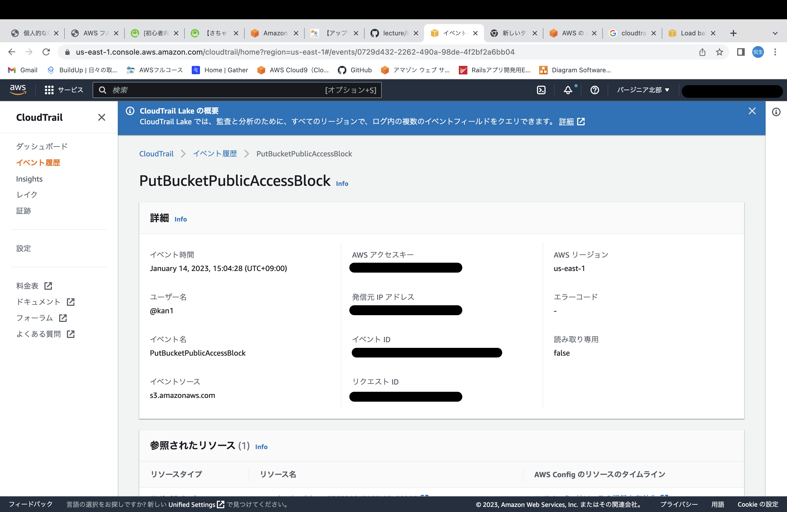
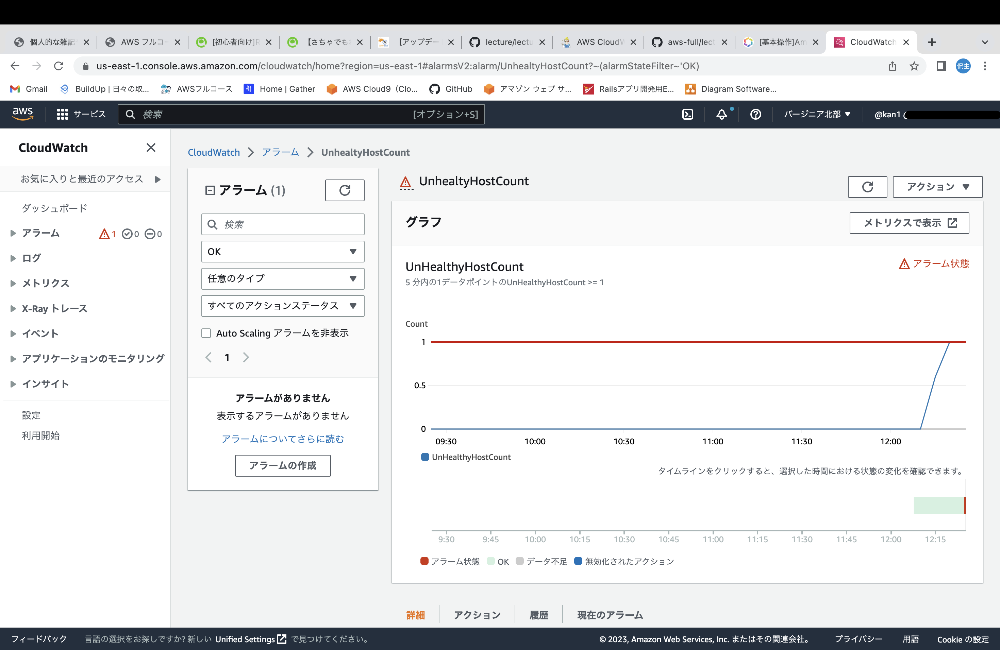
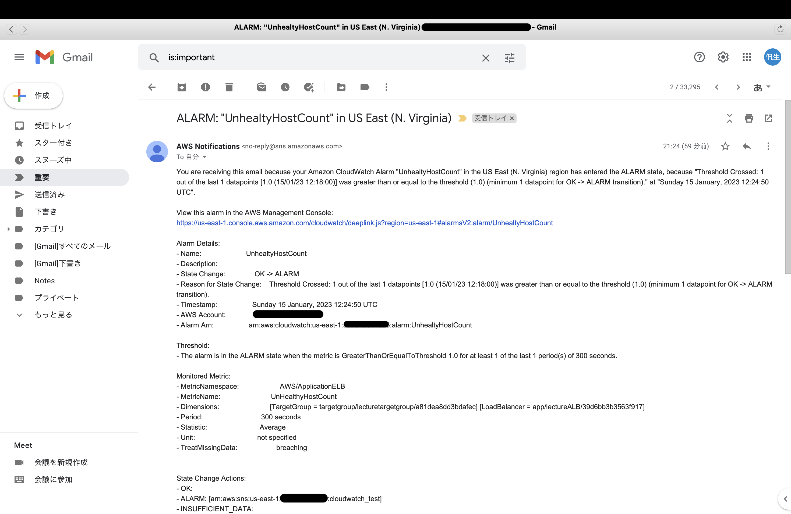
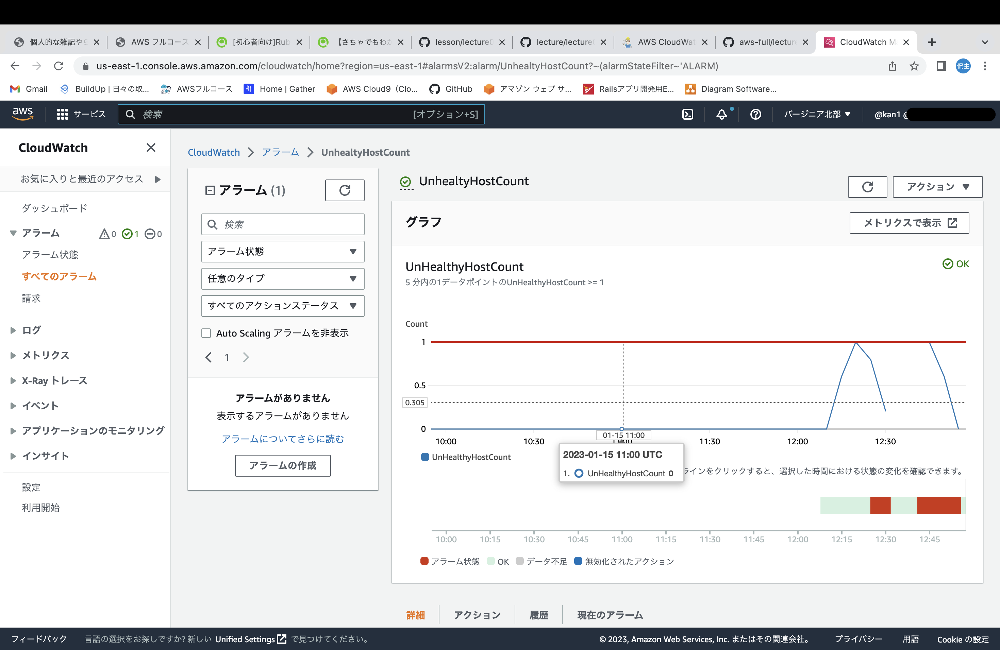
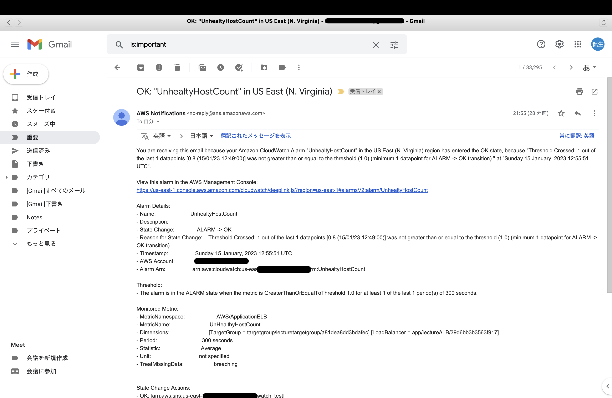
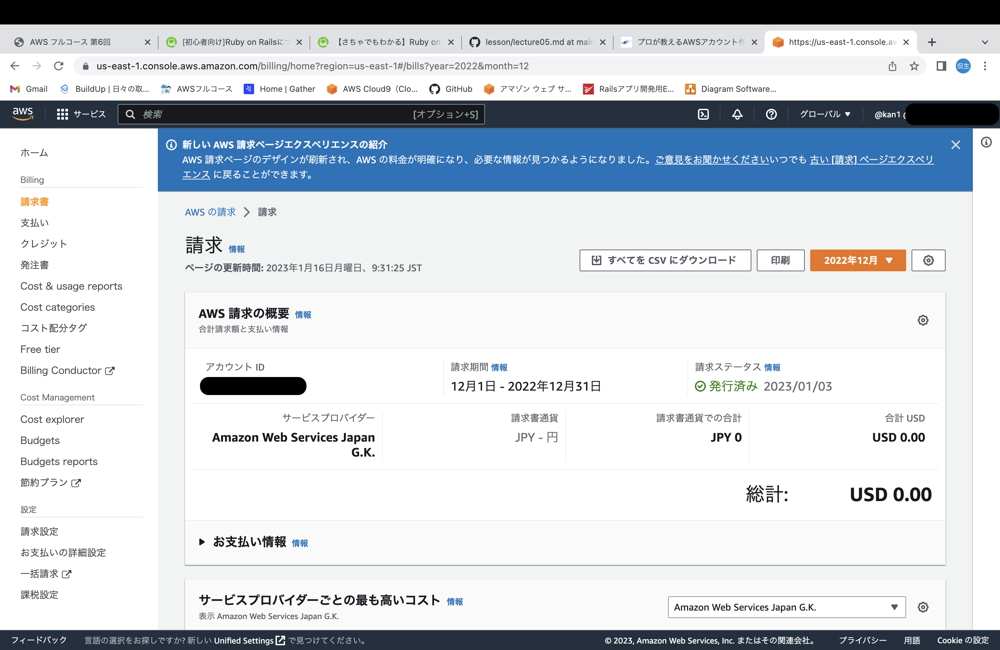

# 第6回課題
## cloudtrail

* 『誰が、いつ、何に対して、何をしたか』を記録するもの
* 記録対象は、マネジメントコンソールやAPIを通した操作

    * [APIとは](https://data.wingarc.com/what-is-api-16084)
    * [AWSでのAPI](https://aws.amazon.com/jp/builders-flash/202209/way-to-operate-api/?awsf.filter-name=*all)

* 記録対象

    * 管理イベント・・・AWSリソース自体の操作履歴

        * eventCategory・・Managment

    * データイベント・・・S3バケット内への操作などのオブジェクトレベルの実行履歴

        * eventCategory・・Data
    
    * インサイトイベント・・・AWSアカウントの異常な操作履歴(普段のCloudtrailログから典型的なパターンを学習し、そこから逸脱したパターンの操作を検出する)

        * eventCategory・・Insight

    * [レコードの内容](https://docs.aws.amazon.com/ja_jp/awscloudtrail/latest/userguide/cloudtrail-event-reference-record-contents.html)

* 課題(見つけたイベントの中にはどんな情報が含まれていますか。イベント名と、含まれている内容3つをピックアップしてください)
    
    
    * いつ

        ```
        "eventTime": "2023-01-14T06:04:28Z",
        ```

    * 誰が

        ```
        "userIdentity": {
        "type": "IAMUser",
        "principalId": "AIDAYDB××××××××",
        "arn": "arn:aws:iam::5563×××××××:user/@kan1",
        "accountId": "5563××××××",
        "accessKeyId": "ASIAYDB××××××××",
        "userName": "@kan1",
        "sessionContext": {
            "sessionIssuer": {},
            "webIdFederationData": {},
            "attributes": {
                "creationDate": "2023-01-14T06:03:20Z",
                "mfaAuthenticated": "true"
            }
        }
        ```
    * 何にたいして

        ```
        "eventSource": "s3.amazonaws.com",
        ```

    * 何をしたか

        ```
        "eventName": "PutBucketPublicAccessBlock",
        ```

        (S3のAPIアクションでアクセス許可のこと)
------
## cloudwatch
* AWSサービスのメトリクス、ログを監視し、可視化するもの
* メトリクスとは・・・AWSサービスから登録されるデータの集合のこと（ex:ec2のCPU使用率やS3のアクセス受信数など）
* アラーム機能
    
    * 特定のメトリクスが閾値を超えた時に、利用者に通知したり、指定したアクションをおこすことができる

* ログ監視機能

    * ログをcloudwatch logsに転送し、マネジメントコンソール上でログ内容を一元的に管理できる
    * 特定の文字列を含むログが出力された場合、アクションを起こせる

* 課題( CloudWatch アラームを使って、ALB のアラームを設定して、メール通知してみてください)
    * アラーム

    
    

    * OK

    
    

------
## 見積もり・現在の利用金額
* 課題(AWS 利用料の見積を作成してください)
    * [見積もりのリンク](https://calculator.aws/#/estimate?id=5311a5ebe86fcd71593e076be6e2abdf7cb1a43d)

* 課題(マネジメントコンソールから、現在の利用料を確認して教えてください)
    * 22.12の請求額

    

-----
## わからない事・やる事リスト
* 見積もりを出したが、リージョンごとで金額が結構違うので、比較してみる
* 色々AWSサービスを作成している（作り直しとかで）ので管理が大変、どれとどれがAPI連携しているのかわからなくなりそう、インフラ構成図を参考にタグ付けを実施する
* 利用料に関する理解を深めたい。どこにお金が発生しているのかをインフラ構成図にまとめるのも良きかも

## 今回の学び
* 運用していくことがとても大切なので、エラーを通知することは非常に大事だと思った。自動でアクションも起こすことができるみたいなので、その辺も勉強したい。
* 登録して1年は無料枠だーと思ってあまり意識せず使用していたが、先日、『AWS Free Limit alert』が届いた。内容は、EC2のスナップショットの無料利用枠を85％使っちゃてるよという内容だった。
* 請求コンソールによく訪れ、確認することを忘れないようにする。
