# 第７回課題

|サービス名|主なアイコン|&nbsp;&nbsp;&nbsp;&nbsp;&nbsp;&nbsp;&nbsp;&nbsp;&nbsp;&nbsp;&nbsp;&nbsp;&nbsp;&nbsp;&nbsp;&nbsp;|サービス名|主なアイコン|
|:---|:---:|---|:---|:---:|
|1.[Amazon CodeGuru](#amazon-codeguru)|||6.[KMS](#kms)|
|2.[AWS WAF](#aws-waf)|||7.[AWS Secrets Manager](#aws-secrets-manager)||
|3.[ACM(AWS Certificate Manager)](#acm)|||8.[AWS Shield](#aws-shield)||
|4.[Inspector](#inspector)|||9.[IAM Access Analyzer](#iam-access-analyzer)||
|5.[Security Hub](#security-hub)|||10.[GuardDuty](#guardduty)|
## Amazon CodeGuru
* CodeGuru ReviewerとCodeGuru Profilerがある
* 上記のツールを活用することで、コードの品質を向上させ、アプリケーションのパフォーマンスを最適化できる
* CodeGuru Reviewer
    
    * AIによりコードの問題を検出し、コードを改善するためのレコメンデーションを提供してくれる
    * 対象言語・・Java、Python 
    * 既存のリポジトリに関連付け使用する(GitHub、GitHub Enterpriseaなど)
    * 主な機能

        *  セキュリティの脆弱性検出・・一般的な脆弱性 (OWASP トップ 10)やAWS内部(APIなど)の脆弱性を見つけ、改善案を示す　[OWASPtop10](https://owasp.org/Top10/ja/)
        * シークレットの検出・・リポジトリまたは設定ファイルにハードコードされているシークレット(パスワード、API キー、SSH キーなど)を検出する　※ハードコード・・ソースコードに直接書き込むこと
* CodeGuru Profiler

    * 稼働しているアプリケーションに対して、コストがかかるコード(無駄なコードがあるとか)を特定し、最適化する
    * EC2、Lambdaなどで稼働中のアプリケーションに対して最適化できる
    * 主な機能

        * アプリケーションの動作把握・・実行中にどのパスが最もリソースを消費しているかを把握し、視覚的(フレームグラフ)に示す
        * 異常の検出・・継続的に分析し、アプリケーションやメソッドの動作から異常を検出する
* [ユーザーガイド](https://docs.aws.amazon.com/codeguru/latest/reviewer-ug/welcome.html)
----                                            
## AWS WAF
* Webアプリケーションの脆弱性を突いた攻撃(不正なリクエスト)を検知、無効化する
* WAFルール(web ACLに定義される)に基づき、管理する　※ACL・・アクセスコントロールリスト　[ウェブACLとは](https://docs.aws.amazon.com/ja_jp/waf/latest/developerguide/web-acl.html)
* WAFルールはAWSで管理されているマネージドツールを利用することもできる
* NetworkFirawall・・ネットワークを防御対象とするもの
* WAFはNetworkFirawallの背後に配置する
* [ユーザーガイド](https://docs.aws.amazon.com/waf/latest/developerguide/waf-chapter.html)

----
## ACM(AWS Certificate Manager)
* SSL/TLS認証書を管理、アップデートできる

    * SSL・・インターネット接続を安全に維持し、システム間で送信される機密情報を保護する(暗号化)セキュリティプロトコル
    * TLS・・SSLのセキュリティを強化した後続プロトコル
    * 認証書の種類

        * ドメイン認証型SSLサーバー証明書・・ドメイン使用権の有無のみを認証する
        * 企業認証型SSLサーバー証明書・・上記の証明書＋Webサイト運営団体の実在性を認証する
        * EV SSL証明書・・企業認証型SSLサーバー証明書より高いレベルの信頼性を実現する
* 認証書の入れ替え作業が不要になる(本来認証書は1年ごとに入れ替えが必要)
* ACMを利用し、SSL/TLS認証書を取得するには、ドメインが必要(AWSではroute53などを使用する)
    * Route53・・DNSウェブサービスのことで、ドメインをIPアドレスに変換する(IPv6にも対応)
* HTTPSに限定する為には、アタッチ先でルールを追加したり、HTTPSに限定する必要がある
* [ユーザーガイド](https://docs.aws.amazon.com/ja_jp/acm/latest/userguide/acm-overview.html)

---
## Inspector
* EC2インスタンスに対して、脆弱性診断を自動で実施するサービス
* 対処が必要なセキュリティ上のリスクがあるか、評価するが、対処はできない
* 脆弱性を評価する為に、どのようなテスト項目を行うかまとめたものをルールパッケージという
* [ユーザーガイド](https://docs.aws.amazon.com/ja_jp/inspector/latest/user/what-is-inspector.html)

---
## Security Hub
* Inspectorなどのサービスで検知されたアラートを１つに集約し、管理できる
* セキュリティチェックを行い、セキュリティ基準に則り、漏れがあれば指摘する
* [ユーザーガイド](https://docs.aws.amazon.com/ja_jp/securityhub/latest/userguide/what-is-securityhub.html)

----
## KMS
* データ保護に使用される暗号化キーを一元管理できる
* [KMSについて](https://dev.classmethod.jp/articles/10minutes-kms/)
* [ユーザーガイド](https://docs.aws.amazon.com/ja_jp/kms/latest/developerguide/overview.html)

----
## AWS Secrets Manager
* データベースの認証情報や、パスワードなどの任意のシークレット情報をAPIコールで取得できる
* アプリケーションにシークレット情報を保存する必要がなくなることで、情報漏洩のリスクと認証情報更新時のリスク(アプリケーションの書き換え時など)に対応できる
* [キーのローテション](https://docs.aws.amazon.com/ja_jp/secretsmanager/latest/userguide/rotating-secrets.html)
* [ユーザーガイド](https://docs.aws.amazon.com/ja_jp/secretsmanager/latest/userguide/intro.html)
---
## AWS Shield
* 主にDDos攻撃からの防御を行える
* WAFとの違い↓

    AWS WAFはOSI参照モデルの7層で行われるDDos攻撃を緩和し、AWS ShieldはOSI参照モデルの3層および4層で行われるDDos攻撃からWebサービスを防御する

* CloudFrontやroute53などのサービスをサポートする
* Shield Advancedという高額な有料プランもある
* [ユーザーガイド](https://docs.aws.amazon.com/ja_jp/waf/latest/developerguide/what-is-aws-waf.html)
---
## IAM Access Analyzer
* まとめるのが難しいので以下参照
* [ユーザーガイド](https://docs.aws.amazon.com/ja_jp/IAM/latest/UserGuide/what-is-access-analyzer.html)
---
## GuardDuty
*   Amazon S3、CloudTrail管理イベントログ、AmazonVPCフローログのAWSCloudTrailデータイベントといったデータソースを分析してAWS 環境内での予期しない、および潜在的に未許可で悪意のあるアクティビティを識別する
* GuardDutyのコンソール、AWS　SDK、GuardDuty HTTPS APIで使用できる
* [ユーザーガイド](https://docs.aws.amazon.com/ja_jp/guardduty/latest/ug/what-is-guardduty.html)
---
## セキュリティを考える
* 第5回の課題で作成したインフラ構成図にセキュリティを追加する
* 本来はコスト面も考え、**受容**することも大切だが、今回はモリモリつけてみる

---

## わからない事・やる事リスト
* KMSについて、暗号化されたデータキーはどのように保管するのか？実際に動作させてみて確認したい
* 実際にサンプルアプリケーションにいくつか取り付けてみる
---
## 思った事
* セキュリティはお金がかかる。取捨選択するには、何に対しては受容するのかをしっかり考える必要があると思った。
* 色々なサービスがあり、こんなあのあったなと引き出せるぐらいは知識として理解する必要があると思った。