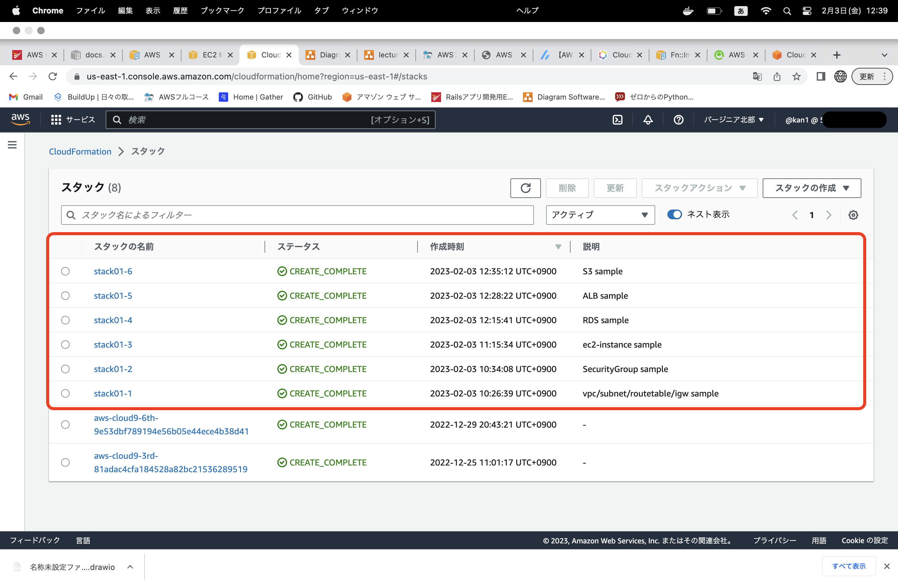

# 第１０回課題
## テンプレートの構成を考える
* インフラ構成図をもとに、作成すべきテンプレートを考える
* 今回は以下の構成図をもとにテンプレートを考える

    

----

## テンプレートを作成する
* 基本的な構造
    * [公式ドキュメント](https://docs.aws.amazon.com/ja_jp/AWSCloudFormation/latest/UserGuide/template-formats.html)
* VPC
    * [AWS::EC2::VPC](https://docs.aws.amazon.com/ja_jp/AWSCloudFormation/latest/UserGuide/aws-resource-ec2-vpc.html)
    * 補足
        * EnableDnsHostnames・・VPC内インスタンスにパブリックDNS名付与の制御、"true"で付与する(有効無効関わらずプライベートDNSは常に付与される)
        * EnableDnsSupport・・AmazonRoute53Resolverが名前解決をサポートするかを制御、"true"で名前解決を実施する
        * InstanceTenancy・・インスタンスがハードウェアを共有するか、専有するかの設定
* Subnet
    * [AWS::EC2::Subnet](https://docs.aws.amazon.com/ja_jp/AWSCloudFormation/latest/UserGuide/aws-resource-ec2-subnet.html)
    * 補足
        * MapPublicIpOnLaunch・・マネジメントコンソールでいうところの『パブリックIPv4アドレスの自動割り当て』のこと、"true"で有効
* IGW
    * [AWS::EC2::InternetGateway](https://docs.aws.amazon.com/ja_jp/AWSCloudFormation/latest/UserGuide/aws-resource-ec2-internetgateway.html)
    * [AWS::EC2::VPCGatewayAttachment](https://docs.aws.amazon.com/ja_jp/AWSCloudFormation/latest/UserGuide/aws-resource-ec2-vpc-gateway-attachment.html)
* Routetable
    * [AWS::EC2::RouteTable](https://docs.aws.amazon.com/ja_jp/AWSCloudFormation/latest/UserGuide/aws-resource-ec2-routetable.html)
    * [AWS::EC2::Route](https://docs.aws.amazon.com/ja_jp/AWSCloudFormation/latest/UserGuide/aws-resource-ec2-route.html)
    * [AWS::EC2::SubnetRouteTableAssociation](https://docs.aws.amazon.com/ja_jp/AWSCloudFormation/latest/UserGuide/aws-resource-ec2-subnetroutetableassociation.html)
* EC2-Instance
    * [AWS::EC2::Instance](https://docs.aws.amazon.com/ja_jp/AWSCloudFormation/latest/UserGuide/aws-properties-ec2-instance.html#cfn-ec2-instance-disableapitermination)
    * 補足
        * ImageId・・今回は常に最新のAMIをパラメータストアに取得させ、参照するようにした。
            * [AWS::SSM::Parameter::Value](https://docs.aws.amazon.com/ja_jp/AWSCloudFormation/latest/UserGuide/aws-resource-ssm-parameter.html)
        *  BlockDeviceMappings・・EC2インスタンスにどのEBS・インスタンスストアを紐つけるか決める設定
            * Encrypted・・ストレージを暗号化するか否か、"true"で暗号化する
            * [ブロックデバイスマッピングとは](https://docs.aws.amazon.com/ja_jp/AWSEC2/latest/UserGuide/block-device-mapping-concepts.html)
        * NetworkInterfaces
            * AssociatePublicIpAddress・・パブリックIPv4を取得するかの制御、"ture"で取得する
            * DeviceIndexを"0"にすることでデバイスインデックスを指定できる
            * [デバイスインデックスについて](https://dev.classmethod.jp/articles/auto-assign-public-ip-by-cfn/)
* KeyPair
    * [AWS::EC2::KeyPair](https://docs.aws.amazon.com/AWSCloudFormation/latest/UserGuide/aws-resource-ec2-keypair.html)
    * 補足
        * 新しいKeypairを作成し、秘密鍵はパラメータストアに保存される
        * [参考](https://blog.serverworks.co.jp/update-ec2-keypair-20220429#CloudFormation%E3%81%A7%E3%82%AD%E3%83%BC%E3%83%9A%E3%82%A2%E3%81%AE%E4%BD%9C%E6%88%90%E5%89%8A%E9%99%A4%E3%81%8C%E5%8F%AF%E8%83%BD%E3%81%AB%E3%81%AA%E3%81%A3%E3%81%9F)
* SecurityGroup
    * [AWS::EC2::SecurityGroup](https://docs.aws.amazon.com/ja_jp/AWSCloudFormation/latest/UserGuide/aws-properties-ec2-security-group.html)
* RDS
    * [AWS::RDS::DBSubnetGroup](https://docs.aws.amazon.com/ja_jp/AWSCloudFormation/latest/UserGuide/aws-resource-rds-dbsubnetgroup.html)
    * [AWS::RDS::DBInstance](https://docs.aws.amazon.com/ja_jp/AWSCloudFormation/latest/UserGuide/aws-resource-rds-dbinstance.html)
* S3
    * [AWS::S3::Bucket](https://docs.aws.amazon.com/AWSCloudFormation/latest/UserGuide/aws-properties-s3-bucket.html)
* ALB
    * [AWS::ElasticLoadBalancingV2::LoadBalancer](https://docs.aws.amazon.com/ja_jp/AWSCloudFormation/latest/UserGuide/aws-resource-elasticloadbalancingv2-loadbalancer.html)
    * [AWS::ElasticLoadBalancingV2::TargetGroup](https://docs.aws.amazon.com/ja_jp/AWSCloudFormation/latest/UserGuide/aws-resource-elasticloadbalancingv2-targetgroup.html)
    * [AWS::ElasticLoadBalancingV2::Listener](https://docs.aws.amazon.com/ja_jp/AWSCloudFormation/latest/UserGuide/aws-resource-elasticloadbalancingv2-listener.html)
* 各種テンプレートリンク先
    * [VPC/subnet/routetable/igwのテンプレート](cfn_temp/vpc_subnet_routetable_igw.yml)
    * [ec2-instanceのテンプレート](cfn_temp/ec2_instance.yml)
    * [セキュリティグループのテンプレート](cfn_temp/securitygroup.yml)
    * [RDSのテンプレート](cfn_temp/rds.yml)
    * [ALBのテンプレート](cfn_temp/alb.yml)
    * [S3のテンプレート](cfn_temp/S3.yml)

-----

## 擬似パラメータ(今回使用した擬似パラメータ)
* AWS::Region
    * リージョンを表す文字列を返す
* AWS::StackName
    * スタックの名前を返す
* [擬似パラメータについて](https://docs.aws.amazon.com/ja_jp/AWSCloudFormation/latest/UserGuide/pseudo-parameter-reference.html)

-----

## 組み込み関数(今回使用した関数)
* Ref:(!Ref)
    * Ref: *論理ID* でIDまたはパラメータの値を返す
* Fn::Sub(!Sub)
    * !Sub ${論理ID}　で文字列を返す　
* Fn::GetAZs
    * Rigion内のAZをアルファベット順に配列したリストを返す
* Fn::Select(!Select)
    * !Select [ *index* , *list* ]　でlistのindex+1番目を返す(indexは0から始まる)
* Fn::ImportValue(!ImportValue)
    * !ImportValue *ShereValuToImport* で他のスタックでoutputした値を返す
* [組み込み関数について](https://docs.aws.amazon.com/ja_jp/AWSCloudFormation/latest/UserGuide/intrinsic-function-reference.html)

----

## 作成したstackの画像

---
## わからない事・やる事リスト
* メタデータを使い、テンプレートを作成してみる
* 色々な関数や擬似パラメータがあるので、他者の作成したテンプレートを見て勉強する
* ~~NetworkInterfacesのセキュリティグループはなぜリストなのか？(2つ以上いるの？)~~
    * リストの形で表記しなさいという事、記法の話でセキュリティグループは2ついるわけではない

----
## 遭遇したエラー
* 大文字になっていない
* 階層が違う
* MySQLのDBNameで予約単語が入っている為、作成できない
* ImportValueとSubの記入方法が間違っている　　　　　などなど・・

---
## 感じた事
* 公式ドキュメントを見ながらテンプレートを作成したが、かなり時間がかかった。コンソール上だと何気なく作成できていたが、テンプレートではそうはいかない。ただ、一つ一つのリソースを調べながら作成したので、なんとなくで作成していたところがよくわかった。構成図がすごく役に立った。
* テンプレートを分割した方が、それぞれで編集できるのでいいかなあと思ったが、outputの名前が被ったりしてエラーが出た。修正がめんどくさかったので、ある程度まとめた方が良いかも・・・スタックが増えると被る確率も高い⁉︎
* 大文字になっていないとか、階層が違うとかでエラー頻発した。コピペ大事だが、間違ったところをコピペしていて修正大変だった。
* KeyPairを作成しパラメータストアに保存できるのは便利だと感じた。
