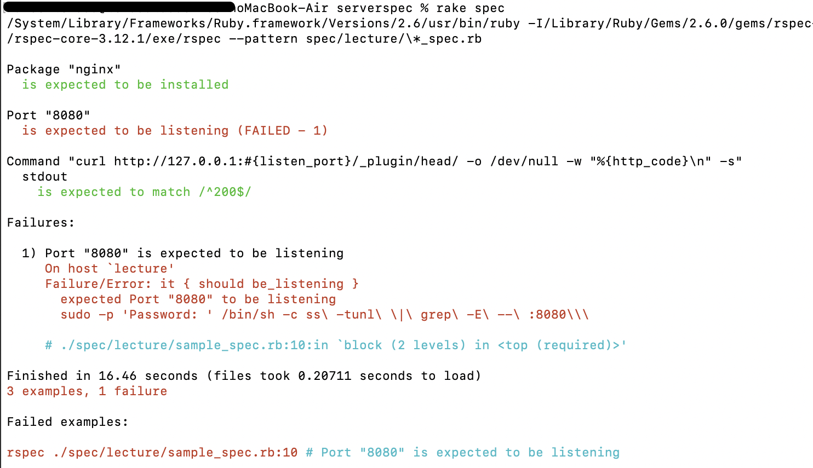
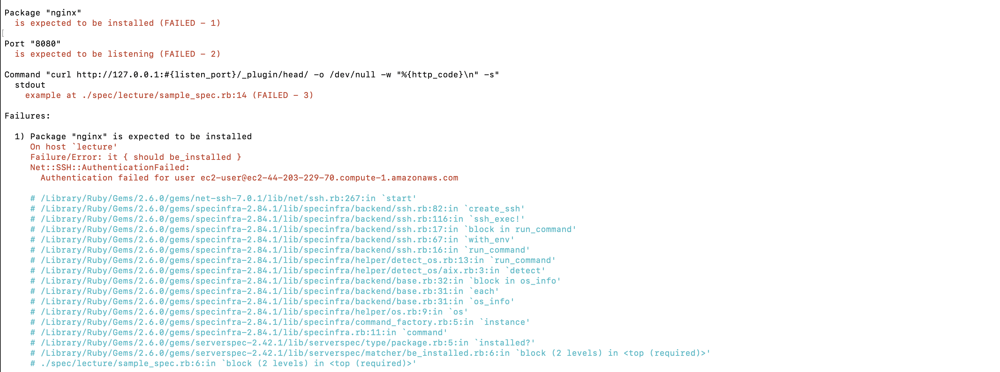

# 第11回課題
## Serverspec
* 導入環境
    * MacOS Ventura 13.1(AppleSilicon)
    * Ruby 2.6.0
* ssh接続でテストを実行する為、ローカル環境にServerspecを導入
    ```zsh
    % sudo gem install serverspec
    ```
* ディレクトリ作成
    ```zsh
    % mkdir serverspec
    % cd serverspec
    ```
* テスト対象の設定
    ```zsh
    % serverspec-init
    ```
    ```
    Select OS type:

      1) UN*X
      2) Windows

    Select number: 1    # OSのタイプを選択、Linuxの為、1を選択

    Select a backend type:

      1) SSH
      2) Exec (local)

    Select number: 1    # SSHで接続する為、1を選択

    Vagrant instance y/n: n    # 仮想化環境ではない為、nを選択
    Input target host name:"@@@@@"    # .ssh/configのホストを記載
    ```
* テストする項目を記載
    ```zsh
    % cd spec
    % cd "@@@@@" # ホスト名
    % vi sample_spec.rb
    ```
    ```sample_spec.rb
    require 'spec_helper'

    listen_port = 8080

    describe package('nginx') do
      it { should be_installed }
    end

    describe port(listen_port) do
      it { should be_listening }
    end

    describe command('curl http://127.0.0.1:#{listen_port}/_plugin/head/ -o /dev/null -w "%{http_code}\n" -s') do
      its(:stdout) { should match /^200$/ }
    end
    ```
    * 今回は、サンプルをコピーして使用した
    * [テストの書き方](https://qiita.com/minamijoyo/items/467ddd13c0cab15330bf)
* テスト実行
    ```zsh
    % rake spec
    ```
    * 実行後のスクショ
        
        * セキュリティグループでポート8080をオープンにしていない為、エラーが出ている

---

## 遭遇したエラー
* テスト実行時、SSH接続できないエラー発生、以下画像参照
    
    * エラーから、.ssh/configの内容を確認したが、おかしい箇所は見つからず。そこで、`VScord`でSSH接続を実施すると、普通に接続できる。ターミナルで接続すると、接続できず、、、ログを確認する
    * SSHのログ吐き出しコマンド
        ```zsh
        % ssh -vvv "ホスト名"
        ```
        <details>
        <summary>吐き出したログ</summary>

        ```zsh
        OpenSSH_9.0p1, LibreSSL 3.3.6
        debug1: Reading configuration data /Users/*/.ssh/config
        debug1: /Users/*/.ssh/config line 11: Applying options for lecture
        debug1: Reading configuration data /etc/ssh/ssh_config
        debug1: /etc/ssh/ssh_config line 21: include /etc/ssh/ssh_config.d/* matched no files
        debug1: /etc/ssh/ssh_config line 54: Applying options for *
        debug3: expanded UserKnownHostsFile '~/.ssh/known_hosts' -> '/Users/*/.ssh/known_hosts'
        debug3: expanded UserKnownHostsFile '~/.ssh/known_hosts2' -> '/Users/*/.ssh/known_hosts2'
        debug1: Authenticator provider $SSH_SK_PROVIDER did not resolve; disabling
        debug1: Connecting to ec2-44-203-229-70.compute-1.amazonaws.com port 22.
        debug1: Connection established.
        debug1: identity file Users/*/.ssh/**.pem type -1
        debug1: identity file Users/*/.ssh/**.pem-cert type -1
        debug1: Local version string SSH-2.0-OpenSSH_9.0
        debug1: Remote protocol version 2.0, remote software version OpenSSH_7.4
        debug1: compat_banner: match: OpenSSH_7.4 pat OpenSSH_7.4* compat 0x04000006
        debug3: fd 5 is O_NONBLOCK
        debug1: Authenticating to ec2-44-203-229-70.compute-1.amazonaws.com:22 as 'ec2-user'
        debug3: record_hostkey: found key type ED25519 in file /Users/*/.ssh/known_hosts:23
        debug3: record_hostkey: found key type ECDSA in file /Users/*/.ssh/known_hosts:24
        debug3: load_hostkeys_file: loaded 2 keys from ec2-44-203-229-70.compute-1.amazonaws.com
        debug1: load_hostkeys: fopen /Users/*/.ssh/known_hosts2: No such file or directory
        debug1: load_hostkeys: fopen /etc/ssh/ssh_known_hosts: No such file or directory
        : load_hostkeys: fopen /etc/ssh/ssh_known_hosts2: No such file or directory
        debug3: order_hostkeyalgs: have matching best-preference key type s sh-ed25519-cert-v01@openssh.com, using HostkeyAlgorithms verbatim
        debug3: send packet: type 20
        debug1: SSH2_MSG_KEXINIT sent
        debug3: receive packet: type 20
        debug1: SSH2_MSG_KEXINIT received
        debug2: local client KEXINIT proposal
        debug2: KEX algorithms: sntrup761x25519-sha512@openssh.com,curve25519-sha256,curve25519-sha256@libssh.org,ecdh-sha2-nistp256,ecdh-sha2-nistp384,ecdh-sha2-nistp521,diffie-hellman-group-exchange-sha256,diffie-hellman-group16-sha512,diffie-hellman-group18-sha512,diffie-hellman-group14-sha256,ext-info-c
        debug2: host key algorithms: ssh-ed25519-cert-v01@openssh.com,ecdsa-sha2-nistp256-cert-v01@openssh.com,ecdsa-sha2-nistp384-cert-v01@openssh.com,ecdsa-sha2-nistp521-cert-v01@openssh.com,rsa-sha2-512-cert-v01@openssh.com,rsa-sha2-256-cert-v01@openssh.com,ssh-ed25519,ecdsa-sha2-nistp256,ecdsa-sha2-nistp384,ecdsa-sha2-nistp521,rsa-sha2-512,rsa-sha2-256
        debug2: ciphers ctos: chacha20-poly1305@openssh.com,aes128-ctr,aes192-ctr,aes256-ctr,aes128-gcm@openssh.com,aes256-gcm@openssh.com
        debug2: ciphers stoc: chacha20-poly1305@openssh.com,aes128-ctr,aes192-ctr,aes256-ctr,aes128-gcm@openssh.com,aes256-gcm@openssh.com
        debug2: MACs ctos: umac-64-etm@openssh.com,umac-128-etm@openssh.com,hmac-sha2-256-etm@openssh.com,hmac-sha2-512-etm@openssh.com,hmac-sha1-etm@openssh.com,umac-64@openssh.com,umac-128@openssh.com,hmac-sha2-256,hmac-sha2-512,hmac-sha1
        debug2: MACs stoc: umac-64-etm@openssh.com,umac-128-etm@openssh.com,hmac-sha2-256-etm@openssh.com,hmac-sha2-512-etm@openssh.com,hmac-sha1-etm@openssh.com,umac-64@openssh.com,umac-128@openssh.com,hmac-sha2-256,hmac-sha2-512,hmac-sha1
        debug2: compression ctos: none,zlib@openssh.com,zlib
        debug2: compression stoc: none,zlib@openssh.com,zlib
        debug2: languages ctos: 
        debug2: languages stoc: 
        debug2: first_kex_follows 0 
        debug2: reserved 0 
        debug2: peer server KEXINIT proposal
        debug2: KEX algorithms: curve25519-sha256,curve25519-sha256@libssh.org,ecdh-sha2-nistp256,ecdh-sha2-nistp384,ecdh-sha2-nistp521,diffie-hellman-group-exchange-sha256,diffie-hellman-group16-sha512,diffie-hellman-group18-sha512,diffie-hellman-group-exchange-sha1,diffie-hellman-group14-sha256,diffie-hellman-group14-sha1,diffie-hellman-group1-sha1
        debug2: host key algorithms: ssh-rsa,rsa-sha2-512,rsa-sha2-256,ecdsa-sha2-nistp256,ssh-ed25519
        debug2: ciphers ctos: chacha20-poly1305@openssh.com,aes128-ctr,aes192-ctr,aes256-ctr,aes128-gcm@openssh.com,aes256-gcm@openssh.com,aes128-cbc,aes192-cbc,aes256-cbc,blowfish-cbc,cast128-cbc,3des-cbc
        debug2: ciphers stoc: chacha20-poly1305@openssh.com,aes128-ctr,aes192-ctr,aes256-ctr,aes128-gcm@openssh.com,aes256-gcm@openssh.com,aes128-cbc,aes192-cbc,aes256-cbc,blowfish-cbc,cast128-cbc,3des-cbc
        debug2: MACs ctos: umac-64-etm@openssh.com,umac-128-etm@openssh.com,hmac-sha2-256-etm@openssh.com,hmac-sha2-512-etm@openssh.com,hmac-sha1-etm@openssh.com,umac-64@openssh.com,umac-128@openssh.com,hmac-sha2-256,hmac-sha2-512,hmac-sha1
        debug2: MACs stoc: umac-64-etm@openssh.com,umac-128-etm@openssh.com,hmac-sha2-256-etm@openssh.com,hmac-sha2-512-etm@openssh.com,hmac-sha1-etm@openssh.com,umac-64@openssh.com,umac-128@openssh.com,hmac-sha2-256,hmac-sha2-512,hmac-sha1
        debug2: compression ctos: none,zlib@openssh.com
        debug2: compression stoc: none,zlib@openssh.com
        debug2: languages ctos: 
        debug2: languages stoc: 
        debug2: first_kex_follows 0 
        debug2: reserved 0 
        debug1: kex: algorithm: curve25519-sha256
        debug1: kex: host key algorithm: ssh-ed25519
        debug1: kex: server->client cipher: chacha20-poly1305@openssh.com MAC: <implicit> compression: none
        debug1: kex: client->server cipher: chacha20-poly1305@openssh.com MAC: <implicit> compression: none
        debug3: send packet: type 30
        debug1: expecting SSH2_MSG_KEX_ECDH_REPLY
        debug3: receive packet: type 31
        ebug1: SSH2_MSG_KEX_ECDH_REPLY received
        debug1: Server host key: ssh-ed25519 SHA256:JvVGrDHW0V7m446SyG2cLELNDJXVZfKEYD14c582qtk
        debug3: record_hostkey: found key type ED25519 in file /Users/*/.ssh/known_hosts:23
        debug3: record_hostkey: found key type ECDSA in file /Users/*/.ssh/known_hosts:24
        debug3: load_hostkeys_file: loaded 2 keys from ec2-44-203-229-70.compute-1.amazonaws.com
        debug1: load_hostkeys: fopen /Users/*/.ssh/known_hosts2: No such file or directory
        debug1: load_hostkeys: fopen /etc/ssh/ssh_known_hosts: No such file or directory
        debug1: load_hostkeys: fopen /etc/ssh/ssh_known_hosts2: No such file or directory
        debug1: Host 'ec2-44-203-229-70.compute-1.amazonaws.com' is known and matches the ED25519 host key.
        debug1: Found key in /Users/*/.ssh/known_hosts:23
        debug3: send packet: type 21
        debug2: ssh_set_newkeys: mode 1
        debug1: rekey out after 134217728 blocks
        debug1: SSH2_MSG_NEWKEYS sent
        debug1: expecting SSH2_MSG_NEWKEYS
        debug3: receive packet: type 21
        debug1: SSH2_MSG_NEWKEYS received
        debug2: ssh_set_newkeys: mode 0
        debug1: rekey in after 134217728 blocks
        debug1: get_agent_identities: bound agent to hostkey
        debug1: get_agent_identities: ssh_fetch_identitylist: agent contains no identities
        debug1: Will attempt key: Users/*/.ssh/**.pem  explicit
        debug2: pubkey_prepare: done
        debug3: send packet: type 5
        debug3: receive packet: type 7
        debug1: SSH2_MSG_EXT_INFO received
        debug1: kex_input_ext_info: server-sig-algs=<rsa-sha2-256,rsa-sha2-512>
        debug3: receive packet: type 6
        debug2: service_accept: ssh-userauth
        debug1: SSH2_MSG_SERVICE_ACCEPT received
        debug3: send packet: type 50
        debug3: receive packet: type 51
        debug1: Authentications that can continue: publickey,gssapi-keyex,gssapi-with-mic
        debug3: start over, passed a different list publickey,gssapi-keyex,gssapi-with-mic
        debug3: preferred publickey,keyboard-interactive,password
        debug3: authmethod_lookup publickey
        debug3: remaining preferred: keyboard-interactive,password
        debug3: authmethod_is_enabled publickey
        debug1: Next authentication method: publickey
        debug1: Trying private key: Users/*/.ssh/**.pem
        no such identity: Users/*/.ssh/**.pem: No such file or directory
        debug2: we did not send a packet, disable method
        debug1: No more authentication methods to try.
        ec2-user@ec2-44-203-229-70.compute-1.amazonaws.com: Permission denied (publickey,gssapi-keyex,gssapi-with-mic).
        ```
        </details>
    * ログから推測すると、やはり秘密鍵の場所がおかしい的な感じと推測、ただパスは間違っていない。`ls -l`コマンドで権限を確認したが、特に気になるところはない。パスを以下のように変更してみたところ、SSH接続できた。
        * 変更前
        ```.ssh/config
        Host "ホスト名"
            HostName ec2-44-203-229-70.compute-1.amazonaws.com
            User ec2-user
            Port 22
            IdentityFile Users/*/.ssh/**.pem
        ```
        * 変更後
        ```.ssh/config
        Host "ホスト名"
            HostName ec2-44-203-229-70.compute-1.amazonaws.com
            User ec2-user
            Port 22
            IdentityFile ~/.ssh/**.pem

---

## わからない事・やる事リスト
* SSH接続がなぜVScordではでき、ターミナルでできなかったのか？、なぜパスを変更したら接続できたのか？　→もう一度権限回りを確認、OSをアプデしちゃったことも影響している？
* テスト内容を考え、記入してみる　→Rubyの記法を確認

---
## 感じた事
* 人によるテストは確かにミスが多いと思う。現在の仕事でもやはり人によるミスが圧倒的に多い。自動でのテストは人によるばらつきをなくすことができ、便利だと感じた。今回はサンプルをそのまま使ったので、どんなテストができるか考えたい。