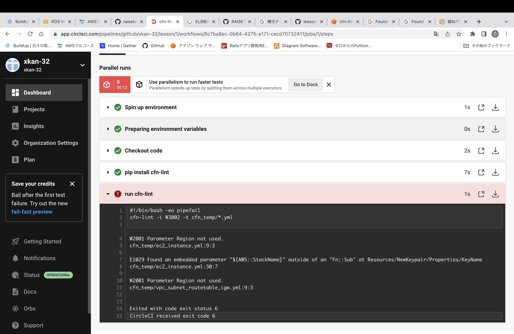
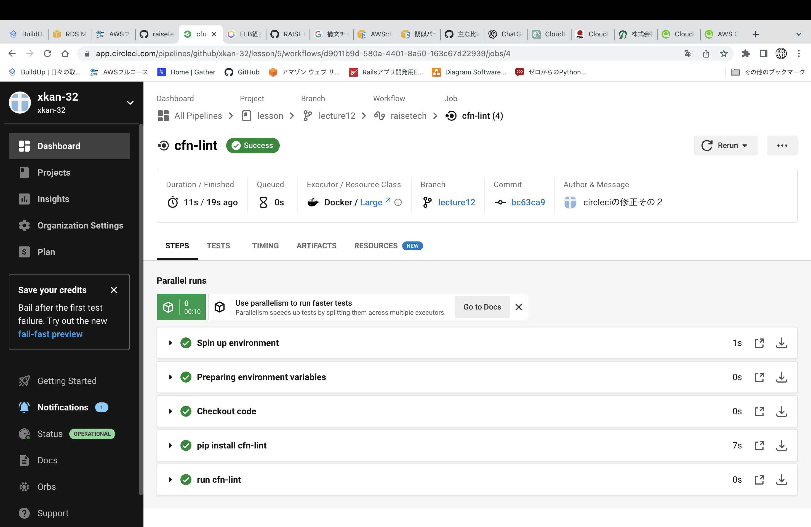
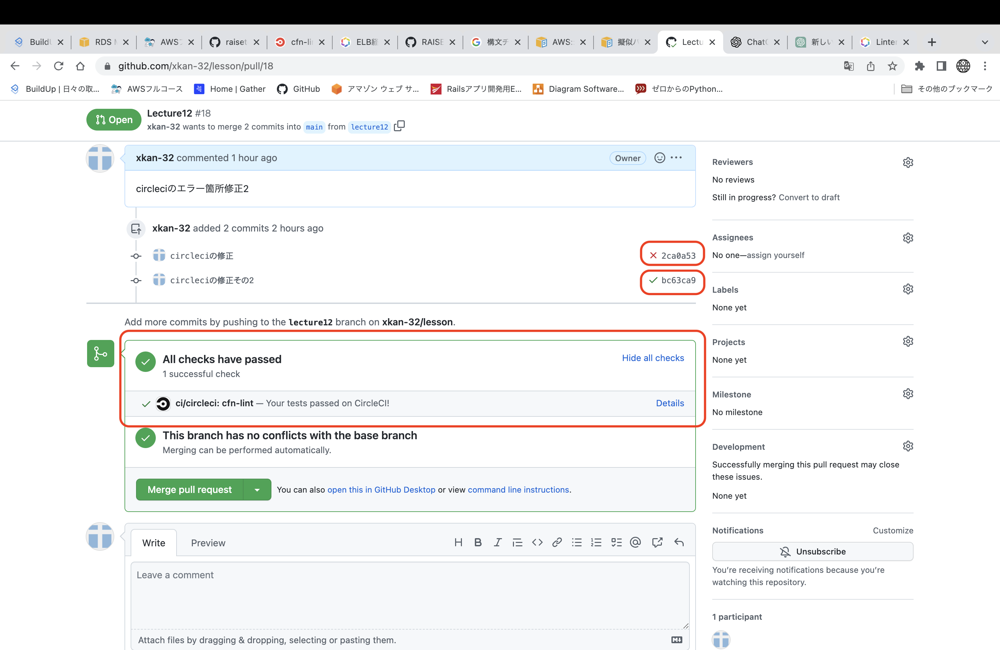

# 第１２回課題
## CircleCI
* [公式サイト]()に従い、セットアップ
* .circleci/config.ymlとして課題のサンプルを使用、テスト実行先を変更
    ```config.yml
    version: 2.1
    orbs:
      python: circleci/python@2.0.3
    jobs:
      cfn-lint:
        executor: python/default
        steps:
          - checkout
          - run: pip install cfn-lint
          - run:
              name: run cfn-lint
              command: |
                cfn-lint -i W3002 -t cfn_temp/*.yml
    workflows:
      raisetech:
        jobs:
          - cfn-lint
    ```
* 第10回課題で作成した、テンプレートに対して、構文テストが実行される
* 結果↓
    
    * ec2_instance.ymlで使用していないパラメータがある
    * ec2_instance.yml擬似パラメータが組み込み関数内で参照されていない
    * vpc_subnet_routetable_igw.ymlで使用していないパラメータがある
* 発生したエラーを修正し、リモートにプッシュすると、構文テストが実行される
* 結果↓
    
    

----

## 感じた事
* CI/CD、アジャイル開発、DevOpsなど、常に市場のニーズに合わせ継続的に開発・維持を実施していく必要があることを知った。素早い対応を継続していくためには、自動化は欠かせないと思った。学習を進める中で、どのようなテストができるだろうか？ということを考えながら勉強を継続して進めたい。