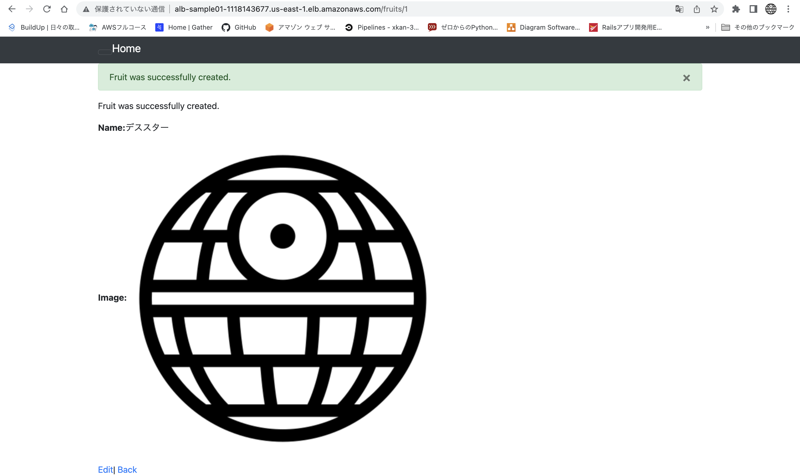

# 第13回課題
## 課題に取り組む前に・・・
### CircleCI
* CircleCIとは・・・Sass型のCI/CDサービスのこと
    * CI/CD(Continuous Integration／Continuous Delivery)
        * 継続的インティグレーション/継続的デリバリー
        * アプリケーション開発の各ステージに自動化を導入し、顧客にアプリケーションを頻繁に提供できるようにする手法
### Ansible
* Ansibleとは・・・プロビジョニング、構成管理、デプロイなど、多くのITプロセスを自動化できるサービスのこと

## 課題
### [課題用のリポジトリ](https://github.com/xkan-32/CI-CD-sample-)
* 上記リポジトリにpush後、CI/CDパイプラインが完了する事を確認する
    * パイプラインが成功した
        
    * ALBのDNSより起動確認
        
    * 画像保存(冪等性確認のため再度1から構築した際、この画像が表示できずエラーとなっていた)
        
    * 画像保存後の画面
        
    * S3に保存
        
## わからないこと・やることリスト
* production環境で実行できたので、lecture05.mdを更新する
* Nginxの設定を見直す(プロキシ周りの勉強をする)
* MySQLをインストールする際に、get_urlモジュールを使用して、ローカルに一度インストールしたかったができなかったので、やり直してみる
## 学んだこと・感想
* 自動化するために、今回はまず手動により、運用環境でデプロイを実行した。開発環境と運用環境では、色々設定する項目が違うので大変だった。
* 次に自動化のためにansibleでplaybookを書いていくが、どのモジュールを使用するとか、一つ一つ調べながらだったので、大変だった。また、パーミッションによるエラーやbashrc/bash_profile周りの設定などを通して色々勉強になった。
    * 使用したモジュール
        * [shell](https://docs.ansible.com/ansible/latest/collections/ansible/builtin/shell_module.html) / [template](https://docs.ansible.com/ansible/latest/collections/ansible/builtin/template_module.html) / [lineinfile](https://docs.ansible.com/ansible/latest/collections/ansible/builtin/lineinfile_module.html) / [command](https://docs.ansible.com/ansible/latest/collections/ansible/builtin/command_module.html) / [file](https://docs.ansible.com/ansible/latest/collections/ansible/builtin/file_module.html) / [git](https://docs.ansible.com/ansible/latest/collections/ansible/builtin/git_module.html) / [stat](https://docs.ansible.com/ansible/latest/collections/ansible/builtin/stat_module.html) / [get_url](https://docs.ansible.com/ansible/latest/collections/ansible/builtin/get_url_module.html) / [yum](https://docs.ansible.com/ansible/latest/collections/ansible/builtin/yum_module.html)
* ansibleで自動デプロイできたので、circleciによる連携で実行できるよう、設定を実施した。ここでは、自動で構築したAWSの環境から、RDSのエンドポイントやALBのDNS名を同一job内のビルド間で共有したい為、環境変数を設定したが、その方法に苦労した。
    1. AWS CLIでALBのDNS名を取得し、txtファイルを出力する
        ```
        - run:
              name: get ALB/DNS
              command: |
                mkdir -p /tmp/workspace
                aws elbv2 describe-load-balancers --names <ALBの名前> --query "LoadBalancers[].DNSName" --output text> /tmp/workspace/alb-dns.txt
        ```
    2. txtファイルを上記コマンドで作成したディレクトリにpersist_to_workspaceを使い格納することでビルド間で共有する
        ```
        - persist_to_workspace:
          root: /tmp/workspace
          paths:
            - alb-dns.txt
    3. 使用したいビルドでattach_workspaceを使いアタッチする
        ```
        - attach_workspace:
          at: /tmp/workspace
        ```
    4. 環境変数として設定する
        * 今回は、起動コマンド(ansible-playbook)にオプションで環境変数を渡し、実行した
            ```
            --extra-vars "ALB_DNS=$(cat /tmp/workspace/alb-dns.txt)"'
            ```
        * ServerSpecの場合
            ```
            env ALB_DNS=$(cat /tmp/workspace/alb-dns.txt) rake spec
            ```
* 冪等性を確認する為、AWSの環境を全て消し、再度pushを実行したが、大きな画像を保存しようとするとエラーがでた。手動でデプロイした時は、小さな画像でしか検証しなかったので、『どのようなチェックをするべきなのか』『こんな時は正しく動作するのか』とか考える必要があると実感した。
* 色々修正して、また失敗してを繰り返したが、ある意味でCI/CDだなと思った。エラーが出た時にとりあえずログを確認することができ、よかったと思う。何かをインストールしたり、サービスを使用する際も、ログはどこに吐き出されるのかを確認するようになった。
* 今回の課題で最も悩んだことが、安全面についてであり、例えば、credentialファイルなどのマスターキーやSSH接続用のキーなどをどのように扱えば安全にあるだろうと考え、今回はCircleCIの環境変数とした。アプリケーション側、サーバー側、IAM権限など色々と対策できると思う。"引き出し"を増やすことが肝心だと思った。
* 全てのデプロイが完了するまで、40分弱だった。自動化はすごいなと思うと同時に、自動化するのは大変だと感じた。ただ、全てうまくできた時は感動しました！