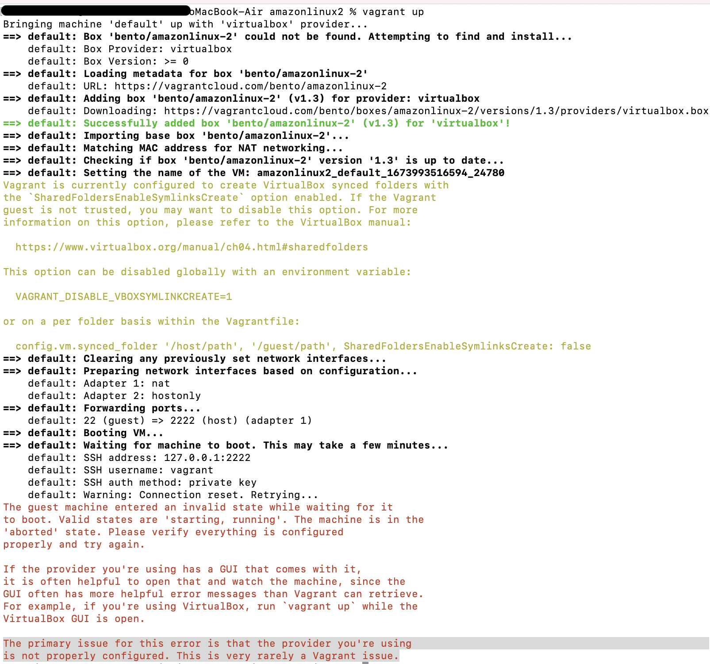

# ローカルにRailsの仮想環境を構築する

## イメージ図


---

## virtualBoxをインストール
* virtualBoxとは・・PC上で別のOSをインストールするための仮想化ソフトのこと
* 以下のリンク先からvirtualBoxをインストールする

    * [リンク先](https://www.virtualbox.org/)

---
## Vagrant をインストール
* Vagrantとは・・仮想環境を構築・管理するツールで、仮想化ソフトをコマンドラインから簡単に統一的に操作できる
* 以下のリンク先からVagrantをインストールする

    * [リンク先](https://developer.hashicorp.com/vagrant/downloads)

----
## 作業ディレクトリ作成
* 作業ディレクトリ、仮想サーバ用のディレクトリ作成
    
    * 今回は、AWS ec2を想定し、vagrant/amazonlinux2を作成する

```zsh
% mkdir vagrant
% cd vagrant      
% mkdir amazonlinux2
```
----
## Vagrantfileを作成する
* Boxを追加し、Vagrantfileを生成する

    * Vagrantfileとは・・仮想環境の構成情報が書かれてるファイルのこと
    * 必要なBox名は、[ここ](https://app.vagrantup.com/boxes/search)で確認
```zsh
% cd amazonlinux2 
% vagrant init bento/amazonlinux-2
```

----
## Vagrantfileの内容を修正する
* エディタで内容を編集する
```zsh 
% vi Vagrantfile
```
* 今回は静的なIPアドレスを設定し、ホストとゲストだけからなるプライベートなネットワークを構築する
* これで仮想マシン上で起動しているWebサーバにアクセスできる
```Vagrantfile
# -*- mode: ruby -*-
# vi: set ft=ruby :

# All Vagrant configuration is done below. The "2" in Vagrant.configure
# configures the configuration version (we support older styles for
# backwards compatibility). Please don't change it unless you know what
# you're doing.
Vagrant.configure("2") do |config|
  # The most common configuration options are documented and commented below.
  # For a complete reference, please see the online documentation at
  # https://docs.vagrantup.com.

  # Every Vagrant development environment requires a box. You can search for
  # boxes at https://vagrantcloud.com/search.
  config.vm.box = "bento/amazonlinux-2"
'↑Boxが設定されている'
  # Disable automatic box update checking. If you disable this, then
  # boxes will only be checked for updates when the user runs
  # `vagrant box outdated`. This is not recommended.
  # config.vm.box_check_update = false

  # Create a forwarded port mapping which allows access to a specific port
  # within the machine from a port on the host machine. In the example below,
  # accessing "localhost:8080" will access port 80 on the guest machine.
  # NOTE: This will enable public access to the opened port
  # config.vm.network "forwarded_port", guest: 80, host: 8080

  # Create a forwarded port mapping which allows access to a specific port
  # within the machine from a port on the host machine and only allow access
  # via 127.0.0.1 to disable public access
  # config.vm.network "forwarded_port", guest: 80, host: 8080, host_ip: "127.0.0.1"

  # Create a private network, which allows host-only access to the machine
  # using a specific IP.
   config.vm.network "private_network", ip: "192.168.33.10"
'↑コメントを外し、ipアドレスを設定'
  # Create a public network, which generally matched to bridged network.
  # Bridged networks make the machine appear as another physical device on
  # your network.
  # config.vm.network "public_network"

  # Share an additional folder to the guest VM. The first argument is
  # the path on the host to the actual folder. The second argument is
  # the path on the guest to mount the folder. And the optional third
  # argument is a set of non-required options.
  # config.vm.synced_folder "../data", "/vagrant_data"
'↑共有フォルダのディレクトリを変更するにはここを変更'
  # Provider-specific configuration so you can fine-tune various
  # backing providers for Vagrant. These expose provider-specific options.
  # Example for VirtualBox:
  #
  # config.vm.provider "virtualbox" do |vb|
  #   # Display the VirtualBox GUI when booting the machine
  #   vb.gui = true
  #
  #   # Customize the amount of memory on the VM:
  #   vb.memory = "1024"
  '↑メモリを変更する場合はここを変更'
'vb.name = "Box名" を追加することでVirtualBox GUI上の名前を指定できる'
  # end
  #
  # View the documentation for the provider you are using for more
  # information on available options.

  # Enable provisioning with a shell script. Additional provisioners such as
  # Ansible, Chef, Docker, Puppet and Salt are also available. Please see the
  # documentation for more information about their specific syntax and use.
  # config.vm.provision "shell", inline: <<-SHELL
  #   apt-get update
  #   apt-get install -y apache2
  # SHELL
end
```
----
## Vagrant 起動
* Vagrantfileのあるディレクトリでコマンド実行
* 初回起動時は時間がかかる
* Runningが表示されれば、起動できている
```zsh
% vagrant up
```
* 起動時エラー発生


  * とても稀なエラーらしい・・・笑。色々試したが、解決できず、、beta版のためかなと思いつつ、virtualboxインストーラーのマニュアルを読んでみると、、、、**macOS13は対応していないらしい！！！** 　まじか・・　7時間ぐらい無駄にした、、ちゃんと確認すべきだった笑

----
## 対応するまでvirtualboxでの仮想化は中断！！